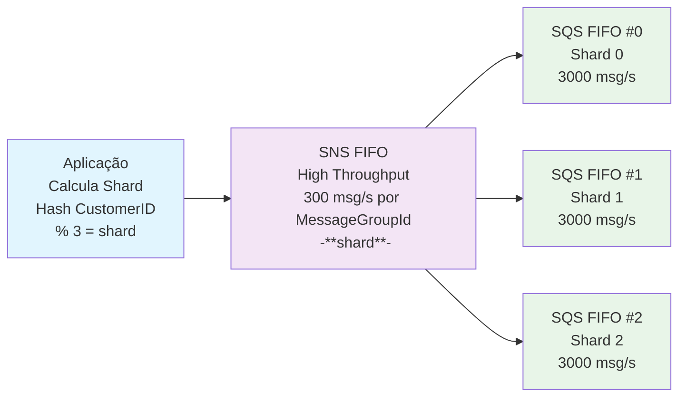
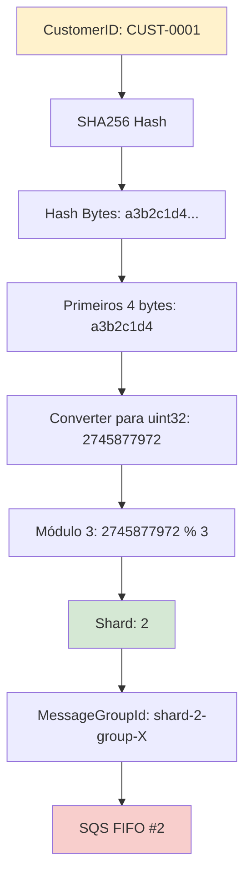

# SNS FIFO High Throughput, SQS FIFO High Throughput e Sharding com Hashing

Esta solução implementa uma arquitetura de alta performance usando **Amazon SNS FIFO** com **High Throughput** e **Amazon SQS FIFO** com **High Throughput** para superar limitações de throttling tradicionais do SQS FIFO. O projeto inclui um sistema de sharding baseado em hash consistente para distribuir mensagens de forma equilibrada entre múltiplas filas.

## Características da Solução

Em filas FIFO (First-In-First-Out), `MessageGroupId` é um atributo que organiza as mensagens em grupos distintos. As mensagens dentro do mesmo grupo são sempre processadas uma de cada vez, em ordem estrita, garantindo que nenhuma mensagem do mesmo grupo seja processada simultaneamente.

### 1. SNS FIFO High Throughput

- **Throughput**: Até 300 msg/s por grupo 
- **Configuração**: `fifo_throughput_scope = "MessageGroup"`

### 2. SQS FIFO High Throughput  
- **Throughput**: Até 3.000 msg/s por MessageGroupId (vs 300 msg/s padrão)
- **Configuração**: `fifo_throughput_limit = "perMessageGroupId"`

### 3. Sharding com Hash Consistente
- **Algoritmo**: SHA256 para distribuição uniforme
- **Chave de Sharding**: CustomerID simulando a partition key para consistência por cliente
- **Distribuição**: 3 shards de filas SQS para balanceamento de carga

## Arquitetura de Referência



## Configurações de Referência

### SNS FIFO High Throughput

Conforme [documentação oficial da AWS](https://docs.aws.amazon.com/sns/latest/dg/fifo-high-throughput.html#enable-high-throughput-on-fifo-topic):

```terraform
resource "aws_sns_topic" "high_throughput_fifo" {
  name         = "example-high-throughput.fifo"
  fifo_topic   = true
  
  # Habilita High Throughput
  fifo_throughput_scope = "MessageGroup"  # ou "Topic"
  
  content_based_deduplication = true
}
```

**Modos de Throughput `fifo_throughput_scope`:**
- `Topic`: 300 msg/s para todo o tópico FIFO
- `MessageGroup`: 300 msg/s por **grupo** FIFO

### SQS FIFO High Throughput

Conforme [documentação oficial da AWS](https://docs.aws.amazon.com/AWSSimpleQueueService/latest/SQSDeveloperGuide/high-throughput-fifo.html):

```terraform
resource "aws_sqs_queue" "fifo_consumers" {
  name       = "example-consumer.fifo"
  fifo_queue = true
  
  # Habilita High Throughput
  deduplication_scope   = "messageGroup"        # vs "queue"
  fifo_throughput_limit = "perMessageGroupId"   # vs "perQueue"
  
  content_based_deduplication = true
}
```

**Limites de Performance:**
- **Standard**: 300 msg/s por fila FIFO
- **High Throughput**: 3.000 msg/s por MessageGroupId

## Algoritmo de Sharding

### Fluxo do Hash Consistente



### Implementação do Hash Consistente

```go
func calculateShard(key string, numShards int) (int, string) {
    // 1. Gerar hash SHA256 da chave
    hasher := sha256.New()
    hasher.Write([]byte(key))
    hashBytes := hasher.Sum(nil)
    
    // 2. Converter para hex para debug
    hashHex := hex.EncodeToString(hashBytes)
    
    // 3. Usar primeiros 4 bytes como uint32
    hashValue := uint32(hashBytes[0])<<24 | 
                 uint32(hashBytes[1])<<16 | 
                 uint32(hashBytes[2])<<8 | 
                 uint32(hashBytes[3])
    
    // 4. Calcular shard usando módulo
    shard := int(hashValue % uint32(numShards))
    
    return shard, hashHex[:16]
}
```

### Implementando uma filter_policy da Fila/Shard  no substription do SNS para o SQS

```hcl
resource "aws_sns_topic_subscription" "sqs_subscriptions" {
  count     = var.num_consumer_queues
  topic_arn = aws_sns_topic.high_throughput_fifo.arn
  protocol  = "sqs"
  endpoint  = aws_sqs_queue.fifo_consumers[count.index].arn

  # Filtro para distribuir mensagens baseado em hash do MessageGroupId
  filter_policy = jsonencode({
    shard = [tostring(count.index)]
  })

  depends_on = [aws_sqs_queue_policy.fifo_consumers_policy]
}
```

### Especificando o Hashing e Shard 

```go
// Calcular shard baseado no CustomerID
shardKey := message.CustomerID
shard, hashHex := calculateShard(shardKey, 3)


// Adicionar informações do shard nos attributes
input := &sns.PublishInput{
	TopicArn:               aws.String(p.topicArn),
	Message:                aws.String(string(messageJSON)),
	MessageGroupId:         aws.String(shardKey),
	MessageDeduplicationId: aws.String(dedupID),
	MessageAttributes: map[string]*sns.MessageAttributeValue{
		"shard": {
			DataType:    aws.String("String"),
			StringValue: aws.String(fmt.Sprintf("%d", shard)),
		},
	},
}
```

## Configuração e Uso

### 1. Deployment da Infraestrutura

```bash
# Aplicar infraestrutura
terraform init
terraform plan
terraform apply --auto-approve
```

### 2. Configurar Aplicação

```bash
# Configurar ARN do tópico SNS
export SNS_TOPIC_ARN=$(terraform output -raw sns_topic_arn)

# Opcional: configurar número de mensagens
export NUM_MESSAGES=10000
```

### 3. Executar Load Test

```bash
cd app/
go run main.go
```


---

**Referências:**
- [SNS FIFO High Throughput](https://docs.aws.amazon.com/sns/latest/dg/fifo-high-throughput.html)
- [SQS FIFO High Throughput](https://docs.aws.amazon.com/AWSSimpleQueueService/latest/SQSDeveloperGuide/high-throughput-fifo.html)
